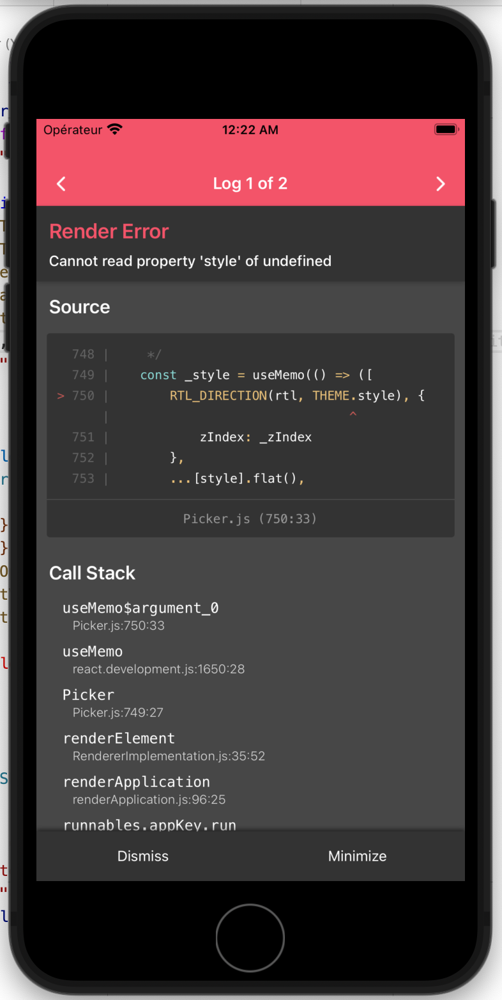

# React Native Dropdown Picker Custom Theming

Issue: https://github.com/hossein-zare/react-native-dropdown-picker/issues/678

## Bug: Can't add a custom theme

### Reproduction Steps

1. Create Expo project with `yarn create expo`
2. Install `react-native-dropdown-picker` with `yarn add react-native-dropdown-picker`
3. Follow the setup instructions to "Add a theme" https://hossein-zare.github.io/react-native-dropdown-picker-website/docs/advanced/themes#add-a-theme

The theme is defined in `myTheme.js`.

The dropdown picker is displayed in `App.jsx`.

### Expected Behavior

Display the dropdown picker with the custom theme.

### Actual Behavior

The dropdown throws an error:

```bash
ERROR TypeError: Cannot read property 'style' of undefined

This error is located at:
in Picker (created by App)
in RCTView (created by View)
in View (created by App)
in App (created by withDevTools(App))
in withDevTools(App)
in RCTView (created by View)
in View (created by AppContainer)
in RCTView (created by View)
in View (created by AppContainer)
in AppContainer
in main(RootComponent), js engine: hermes
```


